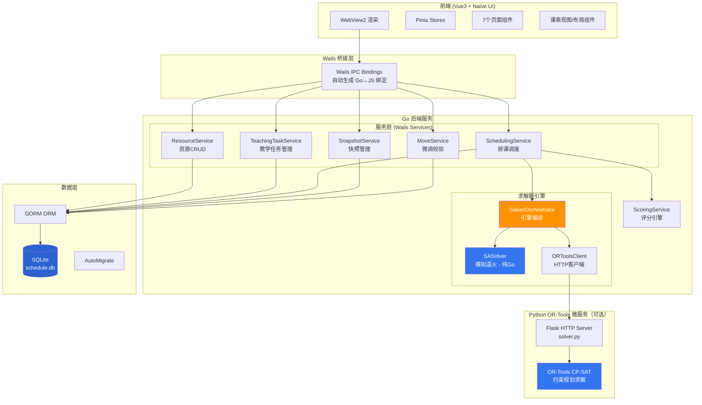
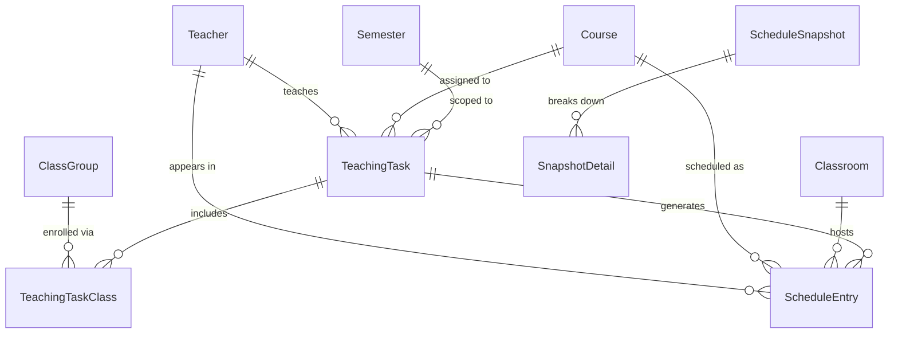

# 高校排课系统 — 完整项目分析报告

> 生成日期：2026-07-11
> 分析方式：全量代码阅读 + 5个并行Agent分析 + ADR文档研读
> 状态：未修改任何代码，纯分析

---

# 1. 项目概述

- **项目名称**：高校排课系统（Scheduling System）
- **项目作用**：为高校（湖北工业大学）提供**智能排课管理系统**，支持自动排课、课表可视化、微调、验证报告、快照对比等完整排课工作流
- **面向用户**：高校教务管理人员 / 排课员
- **主要业务流程**：
  1. 录入基础资源：教师、教室、课程、班级、院系、学期
  2. 创建教学任务：指定（课程 × 教师 × 班级 × 学时参数）
  3. 配置约束与锁定时段（如"周四下午5-8节为党会时间"）
  4. 点击自动排课 → 引擎运行 → 生成课表
  5. 课表可视化查看（周视图/时间线/月视图）
  6. 手动微调拖拽（硬约束校验）
  7. 生成验证报告 + 快照对比

---

# 2. 技术架构

| 维度 | 技术选型 |
|---|---|
| **语言** | Go（后端主语言）、Python 3.12（可选 OR-Tools 微服务）、TypeScript/Vue（前端） |
| **框架** | Wails v3（桌面应用框架，Go + WebView2） |
| **UI框架** | Vue 3 + Naive UI |
| **数据库** | SQLite（本地嵌入式，文件存储） |
| **ORM** | GORM（Go ORM，glabarez/sqlite 驱动） |
| **网络通信** | Wails IPC（Go←→JS绑定）, HTTP(localhost)（Go→Python微服务） |
| **构建工具** | Taskfile.yml（任务编排），Vite（前端构建），uv（Python依赖管理），PyInstaller（Python打包） |
| **第三方依赖** | github.com/wailsapp/wails/v3, gorm.io/gorm, github.com/glebarez/sqlite, Naive UI, Pinia, xlsx, jspdf, html2canvas |
| **AI相关能力** | 无AI/LLM——使用运筹学算法（模拟退火 + OR-Tools CP-SAT）求解排课优化问题 |

---

# 3. 项目目录结构

```
scheduling-system/
├── main.go                          # 应用入口
├── go.mod / go.sum                  # Go模块定义
├── Taskfile.yml                     # 任务编排（构建/开发/打包）
├── wails.json                       # Wails应用元数据
├── CONTEXT.md                       # 领域术语表
├── AGENTS.md                        # AI Agent指令
├── appicon.png                      # 应用图标
│
├── backend/                         # Go后端
│   ├── app.go                       # Wails应用初始化、服务注册、日志
│   ├── appenv/
│   │   └── appenv.go                # 路径解析（dev/prod, 数据目录迁移）
│   ├── config/
│   │   └── config.go                # 配置加载/保存（app.json）
│   ├── database/
│   │   ├── database.go              # DB接口定义、SQLite初始化、AutoMigrate
│   │   └── seed.go                  # 种子数据（19学院、35门课程、19位教师等）
│   ├── models/                      # 数据模型（GORM实体）
│   │   ├── teacher.go               # 教师
│   │   ├── course.go                # 课程
│   │   ├── classroom.go             # 教室
│   │   ├── class_group.go           # 班级
│   │   ├── teaching_task.go         # 教学任务
│   │   ├── teaching_task_class.go   # 教学任务-班级关联
│   │   ├── schedule_entry.go        # 课表条目
│   │   ├── snapshot.go              # 快照 + 快照明细
│   │   ├── semester.go              # 学期
│   │   ├── setting.go               # 键值设置
│   │   ├── department.go            # 院系
│   │   └── types.go                 # DayOfWeek, Period 类型定义
│   ├── seedcheck/                   # 种子数据校验工具
│   │   └── main.go
│   └── services/                    # 服务层
│       ├── resource_service.go      # 资源CRUD + 学期/院系/设置管理
│       ├── teaching_task_service.go  # 教学任务CRUD + 导入导出 + 合班检测
│       ├── scheduling_service.go    # 排课调度入口（核心）
│       ├── scoring_service.go       # 评分引擎（7项软约束）
│       ├── snapshot_service.go      # 快照管理 + 对比
│       ├── move_service.go          # 微调校验（CheckMove + MoveEntry）
│       ├── solver_orchestrator.go   # 多引擎编排器
│       ├── ortools_client.go        # OR-Tools HTTP客户端
│       ├── sa_solver.go             # SA求解器主逻辑
│       ├── sa_initial.go            # 贪心初始解生成
│       ├── sa_neighbors.go          # 邻域操作（Move/Swap）
│       ├── sa_postopt.go            # 贪心后优化
│       └── sa_*_test.go             # 测试
│
├── frontend/                        # Vue3 前端
│   ├── index.html
│   ├── package.json
│   ├── vite.config.ts
│   ├── src/
│   │   ├── main.ts                  # 应用入口（Pinia + Vue）
│   │   ├── App.vue                  # 根组件（Naive UI Provider + 布局）
│   │   ├── types/index.ts           # 前端类型定义
│   │   ├── stores/                  # Pinia 状态管理
│   │   │   ├── app.ts               # 全局应用状态
│   │   │   ├── resource.ts          # 资源管理状态
│   │   │   ├── schedule.ts          # 课表状态
│   │   │   ├── scheduling.ts        # 排课状态
│   │   │   └── ui.ts                # UI状态
│   │   ├── views/                   # 页面组件
│   │   │   ├── SchedulePage.vue     # 课表中心（周/时间线/月）
│   │   │   ├── ResourcePage.vue     # 资源管理
│   │   │   ├── SchedulingPage.vue   # 自动排课
│   │   │   ├── ReportPage.vue       # 验证报告
│   │   │   ├── HistoryComparePage.vue # 历史对比
│   │   │   ├── SettingsPage.vue     # 系统设置
│   │   │   └── SystemManagementPage.vue # 系统管理
│   │   ├── components/              # 可复用组件
│   │   │   ├── layout/              # 布局（Sidebar/Toolbar/Drawer）
│   │   │   ├── schedule/            # 课表视图（Week/Timeline/Month）
│   │   │   └── scheduling/          # 排课评分条
│   │   ├── utils/                   # 工具函数
│   │   └── assets/styles/           # 样式（子午设计系统）
│   └── bindings/                    # Wails自动生成的Go→JS绑定
│
├── scheduler/                       # Python OR-Tools微服务
│   ├── solver.py                    # Flask + CP-SAT求解器
│   ├── pyproject.toml               # Python项目配置
│   ├── uv.lock                      # uv锁定文件
│   └── .venv/                       # 自包含虚拟环境
│
├── docs/                            # 设计文档
│   ├── adr/
│   │   ├── 0001-simulated-annealing.md      # SA选型决策
│   │   ├── 0002-snapshot-pattern.md         # 快照模式
│   │   ├── 0003-db-interface.md             # DB接口抽象
│   │   ├── 0004-teaching-task-entity.md     # 教学任务实体设计
│   │   └── 0005-multi-solver-architecture.md # 多引擎架构
│   └── agents/                      # AI Agent协作文档
│
├── build/                           # 构建配置
│   ├── config.yml                   # Wails构建配置
│   ├── docker/Dockerfile.server     # Docker服务端构建
│   └── scripts/                     # 打包脚本
│
└── bin/                             # 构建输出 + 开发数据目录
```

---

# 4. 系统架构



### 数据流说明

1. **用户操作** → Vue组件 → Pinia Store → Wails IPC → Go Service方法
2. **排课流程**：SchedulingService → SolverOrchestrator → 尝试OR-Tools → 失败降级SA → 返回结果 → 写入DB → 自动快照
3. **课表加载**：SchedulePage → ScheduleStore.loadSchedule() → GetScheduleEntries(semester) → GORM查询 → 返回前端渲染
4. **微调流程**：拖拽 → MoveService.CheckMove() → 硬约束校验 → 通过则 MoveService.MoveEntry() → 更新DB

---

# 5. 模块分析

### 5.1 ResourceService
- **职责**：教师/教室/课程/班级/学期/院系/设置的CRUD，数据库备份/恢复
- **输入**：CRUD参数（GORM model）
- **输出**：模型列表或操作结果
- **依赖**：database.DB, models
- **被调用**：前端所有资源管理页面

### 5.2 TeachingTaskService
- **职责**：教学任务的CRUD、Excel导入导出、合班检测（DetectMergeableTasks）、分班（SplitMergedTeachingTask）
- **输入**：TeachingTask + classGroupIDs
- **输出**：TeachingTask列表
- **依赖**：database.DB, models
- **被调用**：前端资源管理（教学任务Tab）、排课引擎

### 5.3 SchedulingService（核心）
- **职责**：排课调度入口。加载教学任务/资源/锁定时段，调用求解器引擎，保存结果，自动快照
- **输入**：SchedulingConfig（scope, semester, constraints, lockedSlots, weights, timeLimit）
- **输出**：SchedulingResult（scheduled, conflicts, score, scoreDetail, logs）
- **依赖**：database.DB, SnapshotService, SolverOrchestrator, SASolver, ScoringService
- **被调用**：前端排课页面（SchedulingPage）

### 5.4 SASolver（模拟退火）
- **职责**：纯Go实现的模拟退火排课求解器
- **输入**：teachingTasks, teachers, classrooms, classGroups, lockedSlots, constraints, SAConfig
- **输出**：SAResult（entries, score, iterations, elapsedMs）
- **依赖**：models, ScoringService
- **被调用**：SchedulingService, SolverOrchestrator

### 5.5 ScoringService
- **职责**：评估课表质量。7项软约束评分（教师偏好/课程间隔/到校天数/低楼层/周末避让/体育时段/学生疲劳）
- **输入**：entries, teachers, classrooms, enabledConstraints, sportsCourseIDs
- **输出**：ScoreBreakdown（总分0-100 + 各维度分）
- **依赖**：models
- **被调用**：SASolver, SchedulingService, SnapshotService

### 5.6 MoveService
- **职责**：手动微调的前置校验和移动执行
- **输入**：CheckMoveRequest（entryId, newDay, newPeriod, newSpan, newClassroom）
- **输出**：CheckMoveResult（valid, conflicts[]）
- **依赖**：database.DB, models
- **被调用**：前端课表拖拽

### 5.7 SnapshotService
- **职责**：快照创建（auto/manual）、查询、对比
- **输入**：schedule data, semester
- **输出**：ScheduleSnapshot + SnapshotDetail + SnapshotCompareResult
- **依赖**：database.DB, ScoringService
- **被调用**：SchedulingService（自动快照），前端报告/对比页面

### 5.8 SolverOrchestrator
- **职责**：多引擎编排。管理OR-Tools进程生命周期，健康检查，暴露可用性状态
- **输入**：pythonPath, scriptPath, port
- **输出**：ORToolsClient（可用时）
- **依赖**：os/exec, net/http
- **被调用**：app.go（启动时），SchedulingService（排课时）

### 5.9 ORToolsClient
- **职责**：与Python OR-Tools微服务通信
- **输入**：ORToolsInput（JSON）
- **输出**：ORToolsOutput（entries, score, status）
- **依赖**：net/http
- **被调用**：SchedulingService.tryORTools()

---

# 6. 核心数据模型

| 实体 | 表名 | 关键字段 | 关系 |
|---|---|---|---|
| **Teacher** | teachers | code, name, dept, preferNoEarly, preferNoLate, maxDaysPerWeek, preferLowFloor, unavailableSlots(JSON) | has_many ScheduleEntry, has_many TeachingTask |
| **Course** | courses | code, name, dept, credit, type, hours | has_many ScheduleEntry, has_many TeachingTask |
| **Classroom** | classrooms | code, name, building, floor, capacity, type(普通教室/实验室/体育馆/机房) | has_many ScheduleEntry |
| **ClassGroup** | class_groups | code, name, dept, grade, students | has_many ScheduleEntry, m2m TeachingTask(through TeachingTaskClass) |
| **TeachingTask** | teaching_tasks | course_id, teacher_id, semester_id, totalHours, startWeek, endWeek, maxHoursPerWeek | belongs_to Course/Teacher/Semester, has_many TeachingTaskClass, has_many ScheduleEntry |
| **TeachingTaskClass** | teaching_task_classes | teaching_task_id, class_group_id (unique composite) | 关联表 |
| **ScheduleEntry** | schedule_entries | course_id, teacher_id, classroom_id, teaching_task_id, semester, dayOfWeek, startPeriod, span, weeks | belongs_to Course/Teacher/Classroom/TeachingTask, unique (classroom, semester, dayOfWeek, startPeriod) |
| **Semester** | semesters | name, isActive, startDate | has_many TeachingTask |
| **Department** | departments | code, name | - |
| **Setting** | settings | key, value(TEXT) | 键值存储（locked_time_slots等） |
| **ScheduleSnapshot** | schedule_snapshots | semester, dept, trigger, hardPassed, totalScore, teacherPref, courseSpacing, teacherDays, lowFloorPref, solver | has_many SnapshotDetail |
| **SnapshotDetail** | snapshot_details | snapshot_id, entityType, entityCode, entityName, earlyPenalty, latePenalty, daysActual, daysTarget, avgFloor | belongs_to ScheduleSnapshot |

### 实体生命周期

```
Teacher/Course/Classroom/ClassGroup: 创建 → 编辑 → (可选：软删除/标记inactive)
TeachingTask: 创建 → 排课使用 → (可选：合班检测/分班)
ScheduleEntry: 排课生成 → 查看 → 微调 → 排课覆盖清除
Snapshot: 排课自动生成 → 手动生成 → 对比 → 删除
```

---

# 7. 数据流

### 点击"开始排课"按钮的完整调用链

```
用户点击 "开始排课"
  │
  ├─► SchedulingPage.vue（按钮事件）
  │     └─► schedulingStore.startScheduling()
  │           ├─ 构建goConfig（scope, semester, constraints, lockedSlotsJson, weights）
  │           └─► RunScheduling(goConfig)  // Wails IPC 自动绑定
  │
  ├─► [Wails IPC 桥接] ► SchedulingService.RunScheduling(config)
  │     │
  │     ├─ 1. 加载教学任务（scope过滤 + Preload Classes/Course/Teacher）
  │     ├─ 2. 加载教室（status=available）、教师（status=active）、班级
  │     ├─ 3. 加载锁定时段（前端JSON + DB settings 表合并去重）
  │     │
  │     ├─ 4. 尝试 OR-Tools（若可用）
  │     │     └─► tryORTools() → ORToolsClient.Solve(input)
  │     │           HTTP POST /solve → solver.py → CP-SAT 建模求解 → 返回 JSON
  │     │           失败/不可用 → 返回 nil
  │     │
  │     ├─ 5. SA 求解（主引擎或降级）
  │     │     └─► SASolver.SolveMultiRun(..., runs=3)
  │     │           ├─ Run 1: buildInitial() → 贪心初始解
  │     │           │          tryPlaceSession() × sessions → 硬约束检查
  │     │           ├─ SA循环: 温度10.0→0.1, 冷却率0.95, 每温度200次迭代
  │     │           │     tryNeighbor() → 70%move/30%swap
  │     │           │     computeScore() → ScoringService.ScoreSchedule()
  │     │           │     Metropolis接受准则
  │     │           ├─ Run 2 & 3: 不同种子重复
  │     │           └─ PostOptimize(): 对最低分10%条目穷举优化
  │     │
  │     ├─ 6. 事务保存到DB
  │     │     ├─ DELETE old entries WHERE semester=?
  │     │     └─ INSERT new entries
  │     │
  │     ├─ 7. 冲突检测（countConflictsQuick）
  │     ├─ 8. 评分重算（ScoringService）
  │     └─ 9. 自动快照（SnapshotService.CreateSnapshot）
  │
  ├─► 返回 SchedulingResult 到前端
  │     ├─ schedulingStore 更新 result / logs
  │     ├─ 触发刷新课表：scheduleStore.loadSchedule()
  │     └─ 弹出导航提示
  │
  └─► SchedulePage 显示最新课表
```

---

# 8. 页面分析

| 页面 | 文件 | 作用 | 调用的API（Wails绑定） | 状态管理 |
|---|---|---|---|---|
| **课表中心** | SchedulePage.vue | 周视图/时间线/月视图，按教师/教室/班级视角筛选，Excel/PDF导出 | GetScheduleEntries, GetTeachers, GetClassrooms, GetClassGroups | scheduleStore, resourceStore |
| **资源管理** | ResourcePage.vue | 教师/教室/课程/班级/教学任务的CRUD，Excel导入导出 | Get/CRUD Teachers/Classrooms/Courses/ClassGroups, List/Create/Update/Delete TeachingTasks, DetectMergeableTasks, SplitMergedTeachingTask | resourceStore |
| **自动排课** | SchedulingPage.vue | 排课配置（约束选择、权重预设、锁定时段），启动排课，查看日志和结果 | RunScheduling, GetActiveSemester, SaveSetting | schedulingStore |
| **验证报告** | ReportPage.vue | 查看排课评分明细、教师排行、快照管理 | GetSnapshots, GetSnapshotWithDetails, DeleteSnapshot, CreateManualSnapshot | appStore |
| **历史对比** | HistoryComparePage.vue | 两个快照的差异对比（得分/冲突/教师明细） | CompareSnapshots, GetSnapshots | appStore |
| **系统设置** | SettingsPage.vue | 学期管理、锁定时段设置、约束预设 | GetSemesters, CRUD Semester, SaveSetting | appStore |
| **系统管理** | SystemManagementPage.vue | 数据库备份/恢复/导入导出SQL，打开数据目录 | BackupDatabase, RestoreDatabase, GetDatabasePath | - |

---

# 9. API分析

所有API通过Wails Service Binding自动暴露，前端通过 `bindings/scheduling-system/backend/services/*` 调用。

| 服务 | 方法 | 参数 | 返回值 |
|---|---|---|---|
| **ResourceService** | GetTeachers | - | []Teacher |
| | CreateTeacher | Teacher | error |
| | UpdateTeacher | Teacher | error |
| | DeleteTeacher | uint | error |
| | GetClassrooms | - | []Classroom |
| | CRUD Classroom | ... | ... |
| | GetCourses | - | []Course |
| | CRUD Course | ... | ... |
| | GetClassGroups | - | []ClassGroup |
| | CRUD ClassGroup | ... | ... |
| | GetScheduleEntries | semester string | []ScheduleEntry |
| | GetSemesters | - | []Semester |
| | GetActiveSemester | - | *Semester |
| | CRUD Semester | ... | ... |
| | GetDepartments | - | []Department |
| | SaveSetting | key, value string | error |
| | GetSetting | key string | (string, error) |
| | BackupDatabase | path string | error |
| | RestoreDatabase | path string | error |
| | GetDatabasePath | - | string |
| **TeachingTaskService** | ListTeachingTasks | semesterID uint | []TeachingTask |
| | CreateTeachingTask | task, classIDs | error |
| | UpdateTeachingTask | id, task, classIDs | error |
| | DeleteTeachingTask | id uint | error |
| | DetectMergeableTasks | semesterID uint | []MergeableGroup |
| | ImportTeachingTasks | semesterID, rows | (int, []string, error) |
| | ExportTeachingTasks | semesterID | [][]string |
| | SplitMergedTeachingTask | taskID uint | (int, error) |
| **SchedulingService** | RunScheduling | SchedulingConfig | *SchedulingResult |
| **SnapshotService** | GetSnapshots | semester string | []ScheduleSnapshot |
| | GetSnapshotWithDetails | id uint | *ScheduleSnapshot |
| | CreateManualSnapshot | semester string | *ScheduleSnapshot |
| | DeleteSnapshot | id uint | error |
| | CompareSnapshots | aID, bID uint | *SnapshotCompareResult |
| **MoveService** | CheckMove | CheckMoveRequest | *CheckMoveResult |
| | MoveEntry | CheckMoveRequest | error |

---

# 10. 数据库分析

### 全部表（12张）

```sql
-- GORM AutoMigrate 自动生成，以下为逻辑结构：

teachers (id, code UNIQUE, name, dept INDEX, status, prefer_no_early, prefer_no_late, 
          max_days_per_week, prefer_low_floor, unavailable_slots TEXT, created_at, updated_at, deleted_at)

courses (id, code UNIQUE, name, dept INDEX, credit, type, hours, status, created_at, updated_at, deleted_at)

classrooms (id, code UNIQUE, name, building, floor, capacity, type, status, created_at, updated_at, deleted_at)

class_groups (id, code UNIQUE, name, dept INDEX, grade, students, status, created_at, updated_at, deleted_at)

teaching_tasks (id, course_id INDEX, teacher_id INDEX, semester_id INDEX, status, total_hours, 
                start_week, end_week, max_hours_per_week, created_at, updated_at, deleted_at)

teaching_task_classes (id, teaching_task_id INDEX, class_group_id INDEX, 
                       UNIQUE(teaching_task_id, class_group_id), created_at, updated_at, deleted_at)

schedule_entries (id, course_id INDEX, teacher_id INDEX, classroom_id, class_group_id INDEX, 
                  teaching_task_id INDEX, semester, day_of_week, start_period, span, weeks,
                  UNIQUE(classroom_id, semester, day_of_week, start_period), 
                  created_at, updated_at, deleted_at)

semesters (id, name UNIQUE, is_active, start_date, created_at, updated_at, deleted_at)

departments (id, code UNIQUE, name, created_at, updated_at, deleted_at)

settings (id, key UNIQUE, value TEXT, created_at, updated_at, deleted_at)

schedule_snapshots (id, semester INDEX, dept, trigger, hard_passed, teacher_conflicts, 
                    room_conflicts, class_conflicts, locked_violations, total_score, 
                    teacher_pref, course_spacing, teacher_days, low_floor_pref, 
                    weekend_avoid, pe_period_pref, capacity_warn, total_entries, 
                    solve_time_ms, solver, created_at, updated_at, deleted_at)

snapshot_details (id, snapshot_id INDEX, entity_type, entity_code, entity_name, 
                  early_penalty, late_penalty, days_actual, days_target, avg_floor, 
                  capacity_warning, entry_count, days_count, summary, created_at, updated_at, deleted_at)
```

### ER关系图



---

# 11. 排课核心业务流程

### 算法架构

```
算法：模拟退火（SA）+ OR-Tools CP-SAT（可选增强）
策略：多轮重启（3轮不同种子） + 贪心后优化
```

### 输入
- **TeachingTasks**：含课程、教师、班级、总学时、起止周
- **资源池**：可用教室（含类型/容量/楼层）、教师（含偏好）
- **锁定时段**：全校不可排课的（星期, 起始节, 跨度）
- **约束列表**：启用的软约束清单 + 权重

### 处理流程

```
Phase 1: 贪心初始解（buildInitial）
  ├─ 计算每任务每周排课次数（sessionsPerWeek = ceil(totalHours / (weeks × 2)))
  ├─ 随机打乱任务和天/节/教室顺序
  ├─ 对每个session：
  │    ├─ 遍历随机天（周末靠后）
  │    ├─ 遍历有效起始节 [0,2,4,6,8]
  │    ├─ 检查：锁定时段 → 教师不可用 → 教师偏好 → 教师冲突 → 同任务冲突 → 班级冲突
  │    ├─ 遍历随机教室：类型匹配 → 容量适配 → 教室冲突（体育馆共享跳过）
  │    └─ 找到→创建entry，占用资源
  └─ 阶段1（强制偏好）→ 阶段2（放松偏好）

Phase 2: SA迭代优化（Solve/SolveMultiRun）
  ├─ 温度 10.0 → 0.1，冷却率 0.95
  ├─ 每温度层 200 次迭代
  ├─ 邻域操作：
  │    ├─ 70% Move：随机选一个entry → 改变(天, 节, 教室) → 硬约束检查 → 重算分
  │    └─ 30% Swap：随机选两个entry → 交换(天, 节) → 硬约束检查 → 重算分
  ├─ Metropolis准则：Δscore > 0 接受；否则以 exp(Δ/T) 概率接受
  ├─ 取消支持：cancelCh channel
  └─ 进度回调：progressFn(iter, total, currentScore, bestScore, temp)

Phase 3: 贪心后优化（PostOptimize）
  ├─ 识别得分最低的 Top 10% entries
  ├─ 对每个entry穷举所有 (7天 × 5起始节 × N教室) 组合
  ├─ 选择硬约束合规且惩罚最低的位置
  └─ 替换并继续

Phase 4: OR-Tools（可选，优先尝试）
  └─ 构建 CP-SAT 模型 → X[i][s][r][p] 四维决策变量 → Maximize 目标函数 → 求解
```

### 关键约束

**硬约束（不可违反）**：
1. 教师时间不重叠
2. 教室时间不重叠（体育馆除外，可共享）
3. 班级时间不重叠
4. 锁定时段不可排课
5. 教室容量≥班级人数（体育馆无限容量）
6. 教师不可用时段
7. 教室类型匹配（体育→体育馆，实验→实验室，上机→机房，普通→不可用专业教室）
8. 同一教学任务的不同session不重叠

**软约束（0-100权重可调）**：
1. 教师偏好时段（避免早课/晚课）
2. 课程分散（同课程各session分布在不同天）
3. 教师到校天数≤设定值
4. 低楼层优先
5. 周末避让（周六/周日）
6. 体育课优先3-4节或7-8节
7. 学生疲劳度（连续≤4节）

---

# 12. 项目启动流程

```
main()
  │
  ├─ 1. backend.Run(assets)   [app.go]
  │     │
  │     ├─ 2. appenv.EnsureDataDir()
  │     │     创建 %LOCALAPPDATA%/scheduling-system/{logs,config,resources}
  │     │
  │     ├─ 3. appenv.MigrateConfigIfNeeded()
  │     │     首次运行：复制 config/app.json
  │     │
  │     ├─ 4. appenv.MigrateDatabaseIfNeeded()
  │     │     首次运行（生产）：复制 resources/schedule.db
  │     │
  │     ├─ 5. initLogging() → 双输出（stdout + logs/app.log）
  │     │
  │     ├─ 6. config.Load() → 读取 config/app.json
  │     │     SchedulerPort: 19877, PythonPath, DataDir
  │     │
  │     ├─ 7. database.InitDB() → SQLite + AutoMigrate 12张表
  │     │     ├─ MigrateDepartmentsFromSettings() (一次性)
  │     │     └─ SeedData() (idempotent: 种子数据)
  │     │
  │     ├─ 8. NewSolverOrchestrator()
  │     │
  │     ├─ 9. startSchedulerIfAvailable()
  │     │     搜索顺序：
  │     │       a. scheduler/solver.py (dev模式, .venv/python)
  │     │       b. scheduler/scheduler.exe (production, PyInstaller)
  │     │       c. 未找到 → SA-only模式
  │     │     后台轮询 /health 直到就绪（20s超时）
  │     │
  │     ├─ 10. 创建 5 个 Wails Service
  │     │      resources, teachingTasks, scheduler, snapshots, moves
  │     │
  │     ├─ 11. 创建 Wails 应用 + 主窗口 (1440×900)
  │     │      Assets: 嵌入的 frontend/dist/
  │     │
  │     ├─ 12. app.Run() → WebView2 加载 Vue 应用
  │     │
  │     └─ 13. defer orchestrator.StopORTools() → 清理子进程
  │
  └─► 前端 onMounted:
        ├─ loadSemesters() → 设置 semesterFilter
        ├─ resourceStore.loadAll() → 并行加载4类资源
        └─ scheduleStore.loadSchedule(semester) → 加载课表
```

---

# 13. 关键设计模式

| 模式 | 使用位置 |
|---|---|
| **Service Pattern** | Wails Services: ResourceService, TeachingTaskService, SchedulingService, SnapshotService, MoveService——每个都是通过Wails注册的Go结构体 |
| **Repository Pattern** | database.DB接口抽象 + GormAdapter实现——所有数据访问通过DB接口 |
| **Strategy Pattern** | SolverOrchestrator——编排多个求解引擎（SA/OR-Tools），自动选择/降级 |
| **Template Method** | SASolver.Solve()——定义了SA骨架（初始解→迭代→冷却→后优化），子步骤在各文件中实现 |
| **Observer Pattern** | Pinia响应式状态 + computed属性——前端状态变化自动触发UI更新 |
| **Command Pattern** | MoveService.CheckMove → MoveEntry——验证与执行分离 |
| **Memento Pattern** | ScheduleSnapshot——保存课表评估的时间点状态，支持对比回看 |
| **DI（依赖注入）** | app.go中创建服务实例并注入到Wails应用中 |
| **Adapter Pattern** | GormAdapter——将gorm.DB适配为database.DB接口 |
| **Strategy（权重预设）** | CONSTRAINT_PRESETS（balanced/teacher_first/dispersed/low_floor）——不同优化目标组合 |

---

# 14. 配置系统

| 配置项 | 位置 | 说明 |
|---|---|---|
| **SchedulerPort** | config/app.json | OR-Tools微服务端口，默认19877 |
| **PythonPath** | config/app.json | Python可执行文件路径（空=自动检测） |
| **DataDir** | config/app.json | 数据子目录名，默认"resources" |
| **SA参数** | sa_solver.go (defaultSAConfig) | InitialTemp=10.0, CoolingRate=0.95, Iterations=200, MinTemp=0.1, MaxTime=60s |
| **约束权重** | scheduling.ts (CONSTRAINT_PRESETS) | 4组预设权重配置 |
| **锁定时段** | localStorage + settings表 | 前端localStorage为主，DB同步备份 |
| **主题** | localStorage ('theme') | light/dark |
| **环境变量** | LOCALAPPDATA/APPDATA/HOME | 用于解析用户数据目录 |

---

# 15. 代码质量分析

### 优点
- **架构清晰**：分层明确（模型→服务→编排→求解），Wails Service模式规范
- **DB接口抽象**：database.DB接口支持mock测试
- **种子数据完善**：19学院、35课程、19教师、11教室，覆盖全量测试场景
- **ADRs完整**：5份架构决策记录，详细说明了SA vs OR-Tools的取舍
- **多引擎降级**：OR-Tools不可用时自动降级到SA，保证可用性

### 需改进

**重复代码**：
- `getRequiredRoomType` / `roomTypeForCourse` 逻辑在 `sa_solver.go`, `sa_initial.go`, `sa_postopt.go`, `scheduling_service.go` 四处重复定义
- `periodsOverlapInt` 和 Python的 `periods_overlap` 重复实现
- `isTeacherUnavailable` 在 `sa_solver.go` 和 `sa_postopt.go` 中各有独立实现

**潜在Bug**：
- `sa_postopt.go` 中 `buildOcc` 用 `entries` 全局变量访问，但传入参数也是 `entries`——作用域混淆风险
- `schedule_entries` 表唯一索引 `(classroom_id, semester, day_of_week, start_period)` 可能与体育馆共享模式冲突（体育馆允许多班共用但唯一索引会阻止）

**性能问题**：
- `SchedulingService.RunScheduling` 中 Preload Course/Teacher 使用 N+1 查询（循环内单独查询）
- `MoveService.CheckMove` 每次全量加载其他entries做冲突检查，数据量大时可能慢
- SA求解中 `computeScore` 每次移动都重新全量评分（可考虑增量评分）

**可维护性**：
- 前端类型定义与Go模型不完全同步（如Teacher接口缺少unavailableSlots字段）
- 部分函数体过长（如 `solver.py` 的 `solve_scheduling` 约500行）

---

# 16. 后续开发建议

### 新人上手建议阅读顺序

1. **CONTEXT.md** — 领域术语表（必读，5分钟）
2. **docs/adr/0001-simulated-annealing.md** — 为什么用SA
3. **docs/adr/0005-multi-solver-architecture.md** — 多引擎架构
4. **backend/models/** — 所有数据模型（理解数据基础）
5. **backend/services/scheduling_service.go** — 排课调度入口
6. **backend/services/sa_solver.go** — SA求解器骨架
7. **backend/services/sa_initial.go** — 贪心初始解
8. **backend/services/sa_neighbors.go** — 邻域操作
9. **backend/services/scoring_service.go** — 评分系统
10. **frontend/src/stores/scheduling.ts** — 前端排课状态
11. **scheduler/solver.py** — OR-Tools备选引擎

---

# 17. 最终总结

### 一句话总结

**这是一个桌面端高校排课系统（Wails v3 + Vue 3 + SQLite），核心采用纯Go实现的模拟退火算法，可选增强OR-Tools CP-SAT精确求解，覆盖从资源管理→自动排课→课表可视化→微调→评分的完整工作流，为湖北工业大学19个学院设计。**

### 最重要的20个文件

| 排名 | 文件 | 原因 |
|---|---|---|
| 1 | `backend/services/scheduling_service.go` | 排课调度总入口 |
| 2 | `backend/services/sa_solver.go` | SA求解器骨架 |
| 3 | `backend/services/sa_initial.go` | 贪心初始解生成 |
| 4 | `backend/services/sa_neighbors.go` | 邻域操作（move/swap） |
| 5 | `backend/services/scoring_service.go` | 7项软约束评分 |
| 6 | `backend/services/sa_postopt.go` | 贪心后优化 |
| 7 | `backend/app.go` | Wails应用初始化 |
| 8 | `scheduler/solver.py` | OR-Tools CP-SAT备选引擎 |
| 9 | `backend/services/solver_orchestrator.go` | 多引擎编排 |
| 10 | `backend/services/ortools_client.go` | OR-Tools HTTP通信 |
| 11 | `backend/database/database.go` | DB接口+SQLite初始化 |
| 12 | `backend/database/seed.go` | 种子数据 |
| 13 | `backend/models/schedule_entry.go` | 课表条目模型 |
| 14 | `backend/models/teaching_task.go` | 教学任务模型 |
| 15 | `backend/services/move_service.go` | 微调校验 |
| 16 | `backend/services/snapshot_service.go` | 快照管理 |
| 17 | `frontend/src/stores/scheduling.ts` | 前端排课状态+权重预设 |
| 18 | `frontend/src/views/SchedulePage.vue` | 课表中心页面 |
| 19 | `docs/adr/0005-multi-solver-architecture.md` | 架构决策 |
| 20 | `CONTEXT.md` | 领域术语表 |

---

## 附录：排课系统业务深度分析

### 1. 排课约束

**硬约束（算法强制执行，不可违反）**：
- HC1: 教师同一时间只能上一门课
- HC2: 教室同一时间只能被一门课占用（体育馆除外：Type="体育馆"允许多班共用）
- HC3: 同一班级同一时间只能上一门课
- HC4: 锁定时段（如周四下午5-8节党会）不可排课
- HC5: 教室容量 ≥ 班级总人数（体育馆无限容量）
- HC6: 教师个性化不可用时段（JSON数组 {dayOfWeek, startPeriod, span}）
- HC7: 教室类型匹配（体育→体育馆，实验→实验室，上机→机房）
- HC8: 同一教学任务的不同session不重叠

**软约束（评分维度，0-100分加权）**：
| 约束 | Go中key | 权重默认值 | 含义 |
|---|---|---|---|
| 教师偏好 | teacher_preference | 50 | 避免早课(≤第2节)/晚课(≥第7节) |
| 课程分散 | course_dispersed | 50 | 同课程session尽量分布在不同天 |
| 到校天数 | teacher_days_limit | 50 | 教师每周到校天数≤MaxDaysPerWeek（默认3天） |
| 低楼层 | low_floor_preference | 50 | 有preferLowFloor偏好的教师尽量排低层 |
| 周末避让-周六 | avoid_saturday | 30 | 尽量不排周六 |
| 周末避让-周日 | avoid_sunday | 30 | 尽量不排周日 |
| 体育时段 | pe_preferred_periods | 50 | 体育课优先第3-4节或第7-8节 |
| 学生疲劳 | student_fatigue | 50 | 同一班级同一天连续上课≤4节 |

### 2. 排课算法

```
算法名称：模拟退火（Simulated Annealing） + 多轮重启 + 贪心后优化
实现语言：纯Go（零外部依赖）
备选引擎：OR-Tools CP-SAT（Python Flask微服务，HTTP通信，自动降级）

算法流程（4阶段）：
  A. 贪心初始解：洗牌任务 → 随机天/节/教室 → 硬约束过滤 → 逐个放置session
  B. SA主循环：初始温度10.0 → 冷却率0.95 → 200迭代/温度 → 0.1终止
  C. 多轮重启：默认3轮不同种子，时间预算均分，取最高分
  D. 后优化：识别最低分10%条目，穷举(7天×5节×N室) → 接受改进

关键参数：
  - InitialTemp = 10.0
  - CoolingRate = 0.95  
  - IterationsPerTemp = 200
  - MinTemp = 0.1
  - MaxTime = 60s
  - 多轮次数 = 3
  - 后优化比例 = max(5, len(entries)/10)
```

### 3-6. 教师/班级/教室/时间片

**教师模型**：
```
字段：Code(工号), Name, Dept(院系), Status(active/inactive)
偏好：
  - PreferNoEarly: 避免早课（第1-2节，startPeriod≤1）
  - PreferNoLate: 避免晚课（第7节及以后，startPeriod≥6）
  - MaxDaysPerWeek: 每周最多到校天数（默认3天）
  - PreferLowFloor: 优先低楼层教室
  - UnavailableSlots: JSON数组 [{dayOfWeek, startPeriod, span}]
```

**班级模型**：`{ Code, Name, Dept, Grade, Students }` — 通过 TeachingTaskClass 关联到 TeachingTask

**教室模型**：`{ Code, Name, Building, Floor, Capacity, Type }` — 类型：普通教室、多媒体教室、阶梯教室、实验室、机房、体育馆。体育馆共享模式，不检查容量和占用冲突。

**时间片**：
```
一天 = 11节课（Period 0-10，显示为1-11节）
有效起始节 = [0, 2, 4, 6, 8] 即第1/3/5/7/9节
每session固定2节（span=2）
周 = DayOfWeek 0-6（周一至周日）
周数 = 1-16周（默认）
```

### 7-10. 冲突检测/结果生成/数据流/调度流程

冲突检测分布在4个位置：
1. 贪心初始解 tryPlaceSession() → 逐项硬约束检查 → 跳过冲突
2. SA邻域操作 tryMove/trySwap() → 硬约束检查 → 冲突则恢复并拒绝
3. 后优化 PostOptimize() → 穷举检查所有约束
4. 微调 MoveService.CheckMove() → 基于DB的冲突扫描

调度流程：
```
用户触发 → SchedulingService.RunScheduling(config)
           ├─ 加载数据（teachingTasks + Preload）
           ├─ 尝试ORTools（优先）→ 成功返回 or 失败降级
           ├─ SA求解器（3轮）
           ├─ 后优化
           ├─ 事务保存DB
           ├─ 冲突计数
           ├─ 评分重算
           └─ 自动快照
```

### 11. 算法调用入口

```
SchedulingService.RunScheduling(config) → 入口
  ├─ tryORTools(...) → ORToolsClient.Solve() → HTTP → solver.py → CP-SAT
  └─ SASolver.SolveMultiRun(..., runs=3)
       └─ SASolver.Solve(...) × 3 → PostOptimize(...)
```

### 12. 前后端通信

```
Wails v3 自动绑定机制：
  1. Go Service 注册为 Wails Service
  2. wails3 generate bindings 生成前端 TypeScript 绑定
  3. 前端 import { RunScheduling } from 'bindings/...' 直接调用
  4. 通信协议：Wails IPC（WebView ↔ Go，基于 WebSocket 的 RPC）
```

### 13. Python算法服务如何与Go通信

```
1. app.go启动时：
   SolverOrchestrator.StartORTools(pythonPath, scriptPath, port=19877)
   → os/exec.Command 启动 Python 子进程
   → 后台轮询 GET /health 确认就绪

2. 排课时：
   SchedulingService.tryORTools()
   → ORToolsClient.Solve(input)
   → HTTP POST http://127.0.0.1:19877/solve (JSON body)
   → solver.py 的 solve_scheduling() 处理
   → 返回 ORToolsOutput JSON
   → Go 侧转换为 SAResult

3. 退出时：
   defer orchestrator.StopORTools()
   → Process.Kill() 结束子进程
```

### 14. 数据库存储流程

```
排课结果保存（事务）：
  1. BEGIN TRANSACTION
  2. DELETE FROM schedule_entries WHERE semester = ? (硬删除旧数据)
  3. INSERT INTO schedule_entries (新entries)
  4. COMMIT

快照保存：
  1. INSERT INTO schedule_snapshots (评分总分+各维度分+统计)
  2. INSERT INTO snapshot_details (每个教师的明细)
```

### 15. 如何重新排课

1. 用户修改 TeachingTask（增删改）或约束配置
2. 点击"开始排课"
3. SchedulingService.RunScheduling() 重新执行完整流程
4. 旧 schedule_entries 被事务删除，新数据写入
5. 前端自动刷新课表

### 16. 如何导出课表

前端 SchedulePage.vue 提供两种导出：
- Excel导出: XLSX库 → 扁平化课表数据 → xlsx.writeFile()
- PDF导出: html2canvas → 截图 → jsPDF → 打印格式
